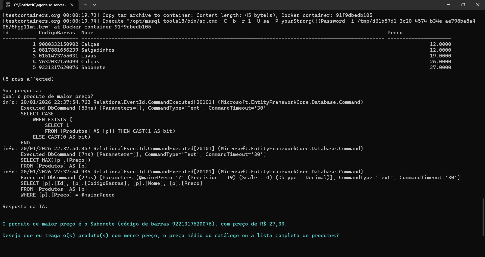
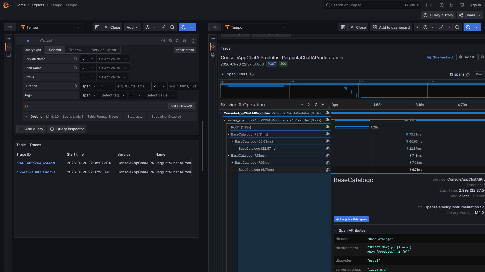

# dotnet10-agent-sqlserver-testcontainers-otel-grafana_consultaprodutos
Exemplo em .NET 10 de Console Application que faz uso do projeto Microsoft Agent Framework, com integração com soluções de IA como Azure Open AI na consulta de informações de produtos em uma base SQL Server. Inclui o uso do Testcontainers para criação do ambiente de testes com os dados + monitoramento com Grafana e OpenTelemetry.

---

## Testes

Aplicação interagindo com IA Generativa + base do SQL Server:

Trace gerado:

